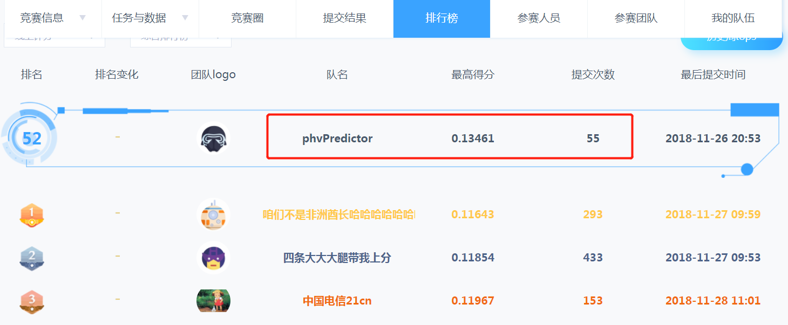

<!-- README.md is generated from README.Rmd. Please edit that file -->

此次比赛我们的名字最后排在**52**名。

<!-- -->

### 实现方式

我们主要的实现方式是

1.  神经网络模型，具体见Python代码`wushen.ipynb`。
2.  Xgboost的融合，具体见R代码`note.Rmd`

### 特征工程

我们尝试的特征工程是

1.  加入滞后项
2.  <mark>加入时间相关变量，见R包`timetk::tk_augment_timeseries_signature`函数</mark>
3.  <mark>加入平方项、立方项，拟合非线性关系</mark>
4.  加入交互项
5.  加入比率
6.  加入滚动SMA
7.  加入滚动方差
8.  <mark>加入PCA的主成分</mark>
9.  加入实发辐射的测试集预测值
10. 加入NMF的衍生变量
11. 加入 [prophet](https://github.com/facebook/prophet)

高亮为测试后效果好的变量。

一系列的特征工程我们在Xgboost进行了融合，

### 不足

我们没有将神经网络和XGboost进行融合，因为没有保存训练集的预测值。
主办方在比赛过程中修改了数据集和评价函数，导致我们无法复现原来的历史预测。
**这是我们下一次比赛需要注意的问题**。

其次，我们一开始没有很好的做EDA，观察被解释变量关于时间的波动，查看异常值。
